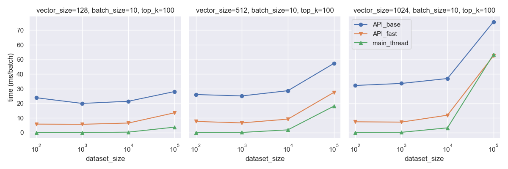

# Index Tools

A suite of tool for indexing large vector bases using `faiss`.

## Building indexes

```python
import faiss
import numpy as np
import tensorstore
import torch

from raffle_ds_research.tools import index_tools

vectors: np.ndarray | torch.Tensor | tensorstore.TensorStore = ...
index: faiss.Index = index_tools.build_index(vectors=vectors, factory_string="IVF100,Flat")
```

## Serving indexes

```python
import faiss
import numpy as np
import torch

from raffle_ds_research.tools import index_tools

index_path: str = "path/to/index/cache"
index: faiss.Index = ...
faiss.write_index(index, index_path)

# spin up a server in a subprocess
with index_tools.FaissMaster(index_path, nprobe=8) as faiss_master:
    faiss_client = faiss_master.get_client()
    query_batch: np.ndarray | torch.Tensor = ...
    results: index_tools.RetrievalBatch = faiss_client.search(query_batch, top_k=10)
```


#### Profiling



To profile the server, run the following command:

```bash
poetry run python -m examples.faiss_server_profile
```